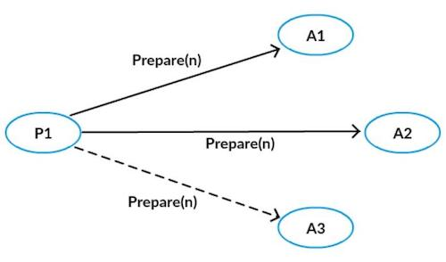

# Paxos Algorithm
A demo of single round paxos algorithm
## Concept
### Prepare Phase
- A proposer selects a proposal number n and sends a prepare request with number n to a majority of acceptors. “If I make a proposal with number n, are there any constraints on the value I must propose?”

-  If an acceptor receives a prepare request with number n, where n is greater than any of the 
prepare requests it has already responded to, then it responds with a promise not to accept any 
more proposals numbered less than n.

- And with the highest numbered proposal (if any) that it has accepted. (Acceptors therefore need 
to maintain as reliable state the highest numbered proposal they have accepted, and the high watermark value of the largest n it has responded to in a prepare request).


### Accept Phase
*Pre-condition*: a proposer has received promise responses to its prepare request numbered n from 
a majority of acceptors. For a cluster with 2F+1 nodes, it allows at most F nodes to fail.

- The proposer sends an accept message for proposal (n,v), where v is the proposal value of the highest numbered accepted proposal amongst the promise responses, or any value the proposer chooses if no prior acceptances are returned.

- If an acceptor receives an accept message for a proposal numbered n, it accepts the proposal 
unless it has already responded to a prepare request with a value higher than n. (Several proposals may be circulating concurrently).


### Learner
Once accepted by the majority, broadcast the conclusion to the rest of the learners.

## Running
- Requirement
    ```
    pip install -r requirements.txt
    ```

- Start (2f+1) nodes. 
    ```
    python node.py 8081
    ```
    
- Set the state. Send the request to multiple nodes to check how they resolve conflicts.
    ```
    curl -XPOST 'http://localhost:8081/state/' -d value=3
    ```
    
    
- Reset to start a new round. 
    ```
    curl -XPOST 'http://localhost:8081/reset/' 
    ```

### Consensus
- Start a 5-node cluster
- Try to set the state with long network delay
   ```
    curl 'localhost:8081/state/' -d 'value=1&delay=5'
   ```
- Try to set the state via another node without network delay
   ```
    curl 'localhost:8083/state/' -d 'value=3'
   ```
- Reset the cluster. Then adjust the delay value, and see how the cluster come to consensus.
